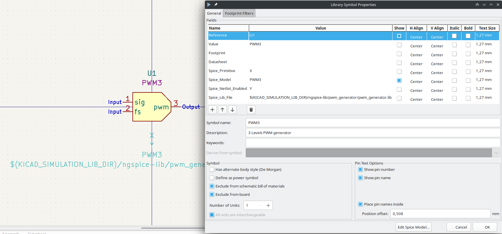
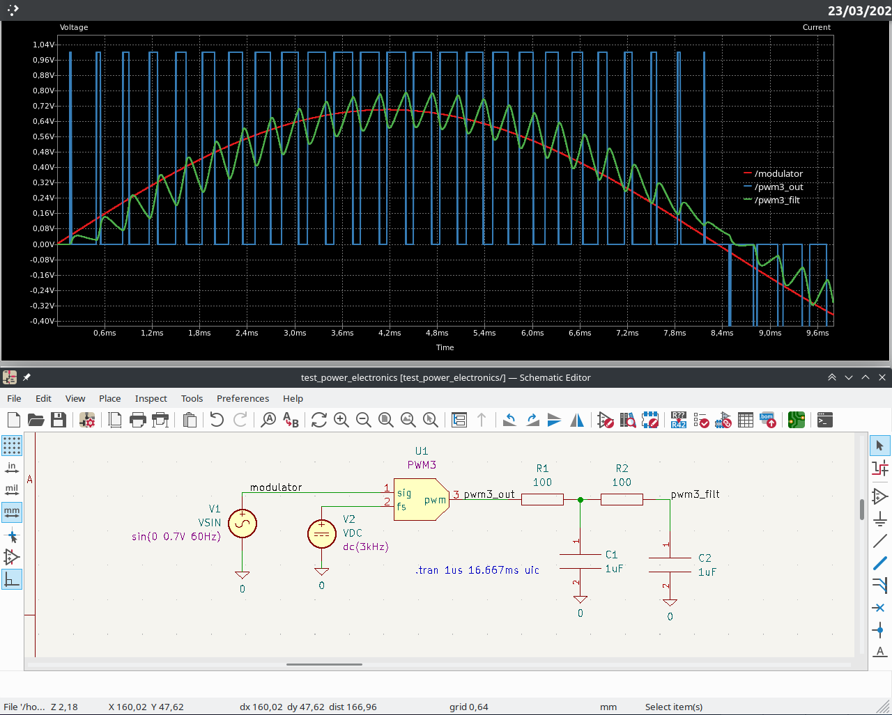

# Setup
1. Set the following path variable to wherever this repo is cloned to in KiCAD under "Preferences" -> "Configure Paths":
	KICAD_SIMULATION_LIB_DIR

	e.g.:	Name: KICAD_SIMULATION_LIB_DIR
		Path:/home/$USER/Documents/Kicad/Simulation_libraries


# Library conventions
* To make a new symbol:
    * Create one with following options checked in the symbol properties:
        * Exclude from schematic bill of materials
        * Exclude from board
    * Edit the Spice model to link the symbol with the model and:
        * Make **Spice_Lib_File** relative to $(KICAD_SIMULATION_LIB_DIR), since it is first generated as absolute path (not portable to other machines)
            * E.g.  Name: Spice_Lib_File
                    Value: $(KICAD_SIMULATION_LIB_DIR)/ngspice-lib/integrator/integrator.lib

    * Make only the following fields visible:
        * Reference (e.g. "X")
        * Spice_Model (e.g. "CCCS g=1")

* Usage
    * Pass subcircuit parameters right after the model name as the value of **Spice_Model**
        * E.g. passing initial condition to the integrator's output
            Name: Spice_Model
            Value: INTEGRATOR ic=10


# Example

## Ngspice model definition (file: ngspice-lib/pwm_generator/pwm_generator.lib)

```
** input nodes:
*           ||=============>signal: arbitrary voltage signal to be
*           ||                      modulated (e.g. sine wave)
*           ||     ||======>freq: carier voltage given as a voltage value
*           ||     ||   ||=>output: PWM output signal
.subckt PWM3 signal freq output

BsawtoothP      sawtoothP       gnd     v=0.5+(time*v(freq)-floor(0.5+time*v(freq)))
BsawtoothM      sawtoothN       gnd     v=-0.5+(time*v(freq)-floor(0.5+time*v(freq)))
Bpwm            output          gnd     v=v(signal)>=v(sawtoothP) && v(signal)>=0 ? 1 : v(signal)<=v(sawtoothN) && v(signal)<=0 ? -1 : 0

.ends PWM3
```

## Symbol creation and model linking



## Usage of symbol with embedded spice model




